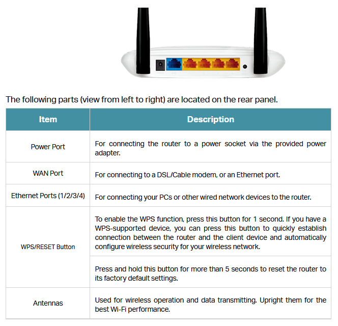
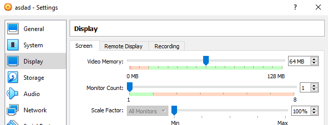
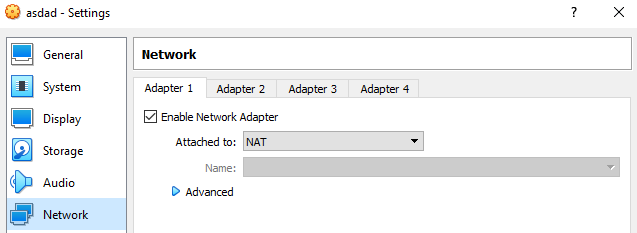
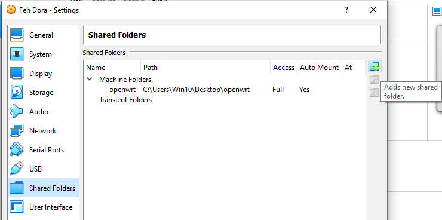
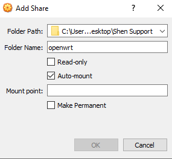

# TP-Link WR841N(D) v14 OpenWRT Windows Guide

This guide details instructions for installing OpenWRT firmware (w/ optional SQM) on, building a custom OpenWRT firmware image for, configuring and factory firmware recovery for TP-Link WR841N(D) v14 on a Windows machine.  
This guide can be somewhat followed with a Linux machine, but does **not** cover the TFTP recovery process on Linux.

If you're looking to buy this model solely for OpenWRT, I can wholeheartedly **NOT** recommend it outside of educational/experimental purposes.

<!-- Full back image: https://static.tp-link.com/TL-WR841N_EU_14.0_03_normal_1524475432652f.jpg -->

Front | Back
:---: | :--:
 | 

## Resources

- See [OpenWRT on SQM](https://openwrt.org/docs/guide-user/network/traffic-shaping/sqm)
- See [OpenWRT device page](https://openwrt.org/toh/tp-link/tl-wr841nd)
- See [Wikipedia on Bufferbloat](https://en.wikipedia.org/wiki/bufferbloat)
- See [OpenWRT on enabling Wi-Fi](https://openwrt.org/docs/guide-quick-start/basic_wifi)
- See [OpenWRT on Wi-Fi configuration](https://openwrt.org/docs/guide-user/network/wifi/basic)
- See [OpenWRT on SQM configuration](https://openwrt.org/docs/guide-user/network/traffic-shaping/sqm_configuration)

## Installing OpenWRT firmware into the router

This very specific model is not officially supported by OpenWRT.  
On top of that, it's one of the so called *4/32* (4MB Flash, 32MB RAM) devices, which are very limiting in terms of both space and performance, and generally not supported/maintained anymore.  
This can potentially result in unwanted instability and you bricking your router. See [OpenWRT 4/32 warning](https://openwrt.org/supported_devices/432_warning).

What if you *really* want OpenWRT installed on this router?  
If you're just looking to get all the basic packages (w/ optional SQM), look at the available OpenWRT firmware disk images from the `files` directory under this repository.  
Otherwise, if you want a custom configuration and/or additional packaged installed, as this specific hardware version (v14) is not officially supported, there's no pre-built OpenWRT firmware disk images available to download.  
Meaning, you will have to build our own image from scratch, using the old OpenWRT imagebuilder with all possible space saving measures.  

### Building the OpenWRT firmware disk image

It is required to build the image in a Linux environment.  
(It's said to be possible in WSL, but I could not get it to work and it's not officially supported by OpenWRT).  
If you're on a linux PC, you're lucky. Otherwise, you have to download a VM.  

#### Linux Distro

As for the linux distribution, I will be using Fedora. Any other linux distro should work as well.  
It's important to use a distro version from 2022 (same release date as OpenWRT v19.07), as any older or newer versions may fail the building process (I learned it the hard way).  
I will be using version 33 ([Download](https://archive.fedoraproject.org/pub/archive/fedora/linux/releases/33/Workstation/)), released 2021

#### VM

In this guide, I will be using [Oracle VirtualBox](https://www.virtualbox.org/).  
After successfully installing both VirtualBox and your linux distro, open VirtualBox and create a new VM.


After doing that, make sure to set the type to `Linux` and select the appropriate version.


Next, set your preferred RAM. Minimum of 4GB is recommended.  
Create a new VDI virtual hard disk.  
**Make sure that the disk size is at least 32GB**. I'm not exactly sure how much is necessary at minimum, but I know for a fact that 16GB, yet alone the default 8GB, is not enough...


Now that the machine has been created, navigate to its settings.  
Set `General > Advanced > Shared Clipboard` to `Bidirectional`. This will help a ton.  


For the ease of use and faster compilation speeds, it is also recommended to, if possible, increase the number of CPUs.  
Navigate to `System > Processor > Processor(s)`


Next, increase the amount of Video Memory to at least **64MB** for fluidity.  
Navigate to `Display > Screen > Video Memory`



Make sure your network adapter is attached to *NAT*.



Next, you must create a shared folder to later transfer firmware disk images between your host PC and the VM.



Name it `openwrt` and set it to automatically mount on boot.



That's all for the settings.  
Next, assign your downloaded distro image to the optical drive.  


Now start the machine.  

In case of Fedora, after the booting process you should be prompted to install the system into the hard drive.  
Do that and make sure to remove the `.iso` image from the optical drive once it's done installing.  
Boot up the machine once again.

#### Installing build system prerequisites

On Fedora, run:

```
sudo dnf --setopt install_weak_deps=False --skip-broken install \
bash-completion bzip2 gcc gcc-c++ git make ncurses-devel patch \
rsync tar unzip wget which diffutils python2 perl-base \
perl-Data-Dumper perl-File-Compare perl-File-Copy perl-FindBin \
perl-IPC-Cmd perl-JSON-PP perl-Thread-Queue perl-Time-Piece \
gawk gettext zlib-devel openssl-devel libxslt \
@c-development @development-tools @development-libs zlib-static perl
```

See [OpenWRT build system setup](https://openwrt.org/docs/guide-developer/toolchain/install-buildsystem) for other distros.

#### Installing the repository

Now we must download the OpenWRT repository from github.  
Newer versions of OpenWRT are not viable for 4/32 devices.  
The latest possible version we can use is v19.07 (2022).  
See [OpenWRT on 4/32 devices](https://openwrt.org/supported_devices/openwrt_on_432_devices).  
The v19.07 repo, however, does not provide official support for v14 hardware as well.  
As explained in the [device page](https://openwrt.org/toh/tp-link/tl-wr841nd) under section "Supported Versions", we must apply a very specific patch to an 19.07.9 repo to add v14 hardware support.
- Patch: https://openwrt.org/_media/media/tplink/tl-wr841/19.07-wr841nv14-wr840nv62.zip
- Commit: https://github.com/openwrt/openwrt/pull/1577 (minimal .config provided)  
*Everything is possible only thanks to this guy*

Open your terminal and execute the following commands:

```
git clone https://github.com/openwrt/openwrt --branch v19.07.9
wget https://openwrt.org/_media/media/tplink/tl-wr841/19.07-wr841nv14-wr840nv62.zip
unzip 19.07-wr841nv14-wr840nv62.zip
git apply 19.07-wr841nv14-wr840nv6.2.patch
```

Now navigate to the the `openwrt` directory with `cd openwrt`

#### Initializing the repository

1. Run `./scripts/feeds update -a` to obtain all the latest package definitions defined in feeds.conf / feeds.conf.default
2. Run `./scripts/feeds install -a` to install symlinks for all obtained packages into package/feeds/

#### Configuring the build

Run `make menuconfig` in order to enter the configuration menu.

Select:
- **Target System**: MediaTek Ralink MIPS
- **Subtarget**: MT76x8 based boards
- **Target Profile**: TP-Link TL-WR841N v14

Select additional packages to install as you wish.  
You cannot later install packages with opkg, as you're going to be using a custom-built image.  
Packages must be built into the image.

In order to mark additional packages for installation, we must first make enough space for them.  
Saving space is all about:
- Disabling as many unwanted packages, kernel modules and settings as you can.
- Building kernel modules into the image
- Modifying build configuration variables

In many cases, you must sacrifice some performance for the sake of flash size.  
I myself could not really do any of the above, as it resulted in the router not working at all (see [General Problems](#general-problems)).  
But if you want to give it a try or get to know more about the topic, check out the following guide: https://openwrt.org/docs/guide-user/additional-software/saving_space

#### Building

The building process requires internet connection.

In order to start the build, navigate to the `openwrt` directory and run `make`.  
If any errors pop up (let's hope not), rerun the build with the `make -j1 V=sc` command in order to see the error messages.  
If you think you have fixed the error, run the build process again without the verbosity (i.e. just `make`).  
Console logging can slow down the build process.

### Transferring the built OpenWRT image into the host PC

After the built process has finished (which for me took a couple of hours), you can find the built OpenWRT image at `bin/targets/ramips/mt76x8/openwrt-ramips-mt76x8-tplink_tl-wr841n-v14-squashfs-tftp-recovery.bin` under your `openwrt` directory.

Now copy the image to the shared folder.
```
cp bin/targets/ramips/mt76x8/openwrt-ramips-mt76x8-tplink_tl-wr841n-v14-squashfs-tftp-recovery.bin /media/sf_openwrt/tl-wr841n-v14-openwrt.bin
```

You can close the Virtual Machine and access the built image by navigating to the shared folder in your host PC.

### Installing the OpenWRT firmware onto the router

With recent versions of this model, you cannot upgrade to third-party firmware from the tp-link web interface.  
You must do it through TFTP. Install the [tftpd64](https://pjo2.github.io/tftpd64/) TFTP server.

Create a new folder and copy the built OpenWRT image into it.  
Rename the image to `tp_recovery.bin`

Next, change your IP address to `192.168.0.66/24`.  
This can be achieved by opening up `Control Panel > Network and Internet > Network and Sharing Center > Change adapter settings > Double-click your selected adapter > Properties > IPv4`.  
Later, after the installing process is finished, you can change the IP address back to automatic (DHCP).

Now you can open up the installed TFTP server, tftpd64.  
Change the current directory to the freshly creater folder with the built OpenWRT image by clicking *Browse*.


Navigate to *Log Viewer* and make sure your server interface is set to your `192.168.0.66` interface.

Now unplug the power connector from your router. Then hold the reset button and, while still holding the button, plug in the power connector and continue holding the reset button until you see the `tp_recovery.bin` file transfer complete in the *tftpd64* log viewer.

You can now close the *tftpd64* software and change your IP address back to automatic (DHCP).  
Your router should be up-and-running in upto a minute time.  
Enjoy your bufferbloat-free experience!

## Configuring the router through SSH

After you see the router solid light up the internet LED, you can now access it through SSH.  
To do so, run the following command in the *Windows Command Line*:
```
ssh root@192.168.1.1
```

Now, you have full root access to your router and can do whatever you want.

Here's an example script that I run on every reboot to initialize SQM and wireless routing.

```sh
# Wireless
uci set wireless.radio0.country='PL'
uci set wireless.radio0.disabled='0'
uci set wireless.default_radio0.ssid='TP-Link_E013'
uci set wireless.default_radio0.wmm='1' # allows 802.11n
uci commit wireless
wifi reload

# Firewall
uci set firewall.@defaults[0].flow_offloading='0'
uci set firewall.@defaults[0].flow_offloading_hw='0'
uci commit firewall
service firewall restart

# SQM
uci set sqm.eth1.enabled='1'
uci set sqm.eth1.interface='eth0.2' # WAN
uci set sqm.eth1.download='5000'
uci set sqm.eth1.upload='2000'
uci set sqm.eth1.qdisc='cake'
uci set sqm.eth1.script='piece_of_cake.qos'
uci set sqm.eth1.linklayer='ethernet'
uci commit sqm
service sqm restart
```

## General Problems

In my case, OpenWRT doesn't save any configuration files (or any files really for that matter) after rebooting.  
All changes made to all the files are gone, as if I ran a factory-reset and everything was saved in RAM.

During the building process, it is advised by OpenWRT to run everything without root access.  
Despite that, with every command, I've gotten *access denied* errors.  
This led me to run every command with `sudo`.  
The Makefile didn't let that slide and threw an error to not use root privilages.  
In order to ignore that error and grant all access permissions to the `openwrt` directory, you can run
```bash
export FORCE_UNSAFE_CONFIGURE=1
chmod -R 777 openwrt
```  

Disabling the firewall service with either `fw3 stop`, `service firewall stop` or `opkg remove firewall` results in no internet connection?

Could not get the space-optimized build to work:
- See [files/openwrt-ramips-mt76x8-tplink_tl-wr841n-v14-squashfs-tftp-recovery-sqm-optimized.bin](files/openwrt-ramips-mt76x8-tplink_tl-wr841n-v14-squashfs-tftp-recovery-sqm-optimized.bin)
- See [OpenWRT on saving space](https://openwrt.org/docs/guide-user/additional-software/saving_space)
- The final built image did not seem to get any lighter in size?

## Restoring back to factory firmware

Restoring back to factory firmware should be as easy as downloading the latest firmware image from [the official tp-link website](https://www.tp-link.com/no/support/download/tl-wr841n/#Firmware) and going through the exact same process as installing OpenWRT firmware into the router through TFTP.  
But it is not, as you must obtain a stripped (not boot) factory firmware image.  
In order to do that, you can either strip it yourself, or download one from the `files` directory under this repository (only PL versions available, not really legal but should work).

To strip it yourself, download the factory boot firmware image from tp-link and move it into the shared VM folder.  
Name the image `boot.bin` and run your linux VM to execute the following command in the terminal:
```
cd /media/sf_openwrt
dd if=boot.bin of=stripped.bin skip=1 bs=512
```
Now you can close the VM.

Follow the same instructions as with installing an OpenWRT image, instead using the stripped `stripped.bin` image located in your shared folder.  
At the end of this process, your router should be back to its factory firmware, with all its glory!
